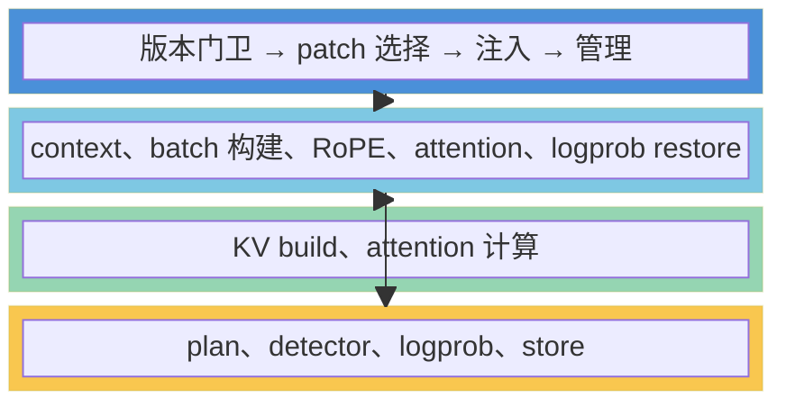
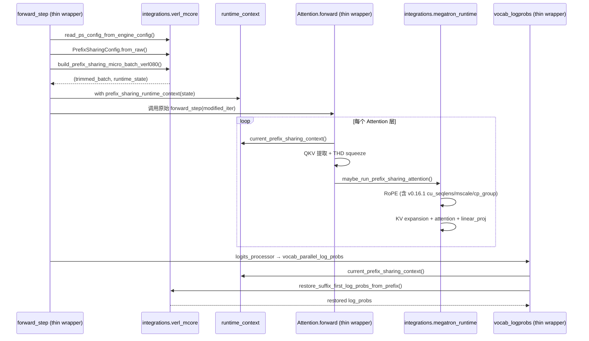

# `prefix_sharing/setup/` 模块设计文档

> 本文档描述 `setup` 模块的架构、职责边界、与其他模块的关系、文件清单、兼容矩阵、使用方式。

---

## 1. 模块概览

### 1.1 定位：轻量级 patch 注入层

`setup` 是 prefix-sharing 四层架构中的引导层，职责单一且忠实：**版本校验 → patch 选择 → 注入 → 管理**。所有业务逻辑由 `integrations/` 处理，setup 的 patch wrapper 是 thin wrapper，只做编排调用 + 设置 runtime context。



### 1.2 职责边界

setup 模块**只做三件事**：

| 职责 | 说明 |
|------|------|
| **版本校验** | 探测运行环境中的 verl、Megatron Core、MindSpeed 版本，对照兼容矩阵决定能否 patch |
| **patch 注入** | 为校验通过的版本组合，选择对应的 thin wrapper patch，通过 `PatchRegistry` 运行时替换目标方法 |
| **patch 管理** | 提供 `describe()` 查看 patch 详情、`disable()` 回滚并打印恢复日志 |

setup **不做的事**：

- ❌ 不做 prefix detection、KV expansion、logprob restore、attention 计算——这些在 `core/`、`backends/`、`integrations/`
- ❌ 不沉淀任何 prefix-sharing 语义逻辑
- ❌ 不修改 `dependency/` 中任何源码文件
- ❌ 不包含业务逻辑函数（RoPE、batch trim、logprob restore 等）——这些全部在 `integrations/`

### 1.3 与 integrations/ 的关系

setup 的 patch wrapper **是 integrations 层的 thin wrapper**，编排调用顺序和设置 runtime context，不重复实现业务逻辑：

| patch wrapper | 调用的 integrations 函数 |
|---|---|
| `forward_step.py` | `integrations.verl_mcore.read_ps_config_from_engine_config` + `build_prefix_sharing_micro_batch_verl080` |
| `attention.py` | `integrations.megatron_runtime.maybe_run_prefix_sharing_attention` |
| `vocab_logprobs.py` | `integrations.verl_mcore.restore_suffix_first_log_probs_from_prefix` |

**唯一跨层共用点**：`integrations/context.py`（ContextVar + `prefix_sharing_runtime_context`）——这是 runtime 机制，setup 和 integrations 共用。

---

## 2. 架构设计

### 2.1 模块内部结构

```
prefix_sharing/setup/
├── __init__.py                  # install(), check(), IncompatibleEnvironment
├── version_guard.py             # detect_versions() → DetectedVersions
├── compat_matrix.py             # COMPAT_MATRIX, CompatEntry
├── registry.py                  # PatchSpec, PatchRegistry + import hook
├── logged_patch.py              # LoggedPatchManager, PatchHandle
└── patches/
    ├── __init__.py              # re-export PatchSpec
    └── verl080_mcore0161_ms0160/
        ├── __init__.py          # PATCH_SET 导出
        ├── forward_step.py      # thin wrapper: 读 config → 构建状态 → 设 context
        ├── attention.py         # thin wrapper: QKV 提取 → delegate to integrations
        └── vocab_logprobs.py    # thin wrapper: 调原始 → delegate restore to integrations
```

### 2.2 组件职责表

| 组件 | 核心类/函数 | 职责 |
|------|------------|------|
| `__init__.py` | `install()`, `check()`, `IncompatibleEnvironment` | 公共 API 入口，协调校验→匹配→注入 |
| `version_guard.py` | `detect_versions()` → `DetectedVersions` | 探测运行时版本 |
| `compat_matrix.py` | `COMPAT_MATRIX` → `CompatEntry` | 版本兼容规则表，精确字符串匹配 |
| `registry.py` | `PatchSpec`, `PatchRegistry` | Patch 注册 + import hook 调度 |
| `logged_patch.py` | `LoggedPatchManager`, `PatchHandle` | 属性替换 + 日志 + 回滚 |
| `patches/verl080_mcore0161_ms0160/` | 3 个 thin wrapper | 编排调用 + 设置 context |

### 2.3 Patch 联动数据流



---

## 3. 版本兼容性

### 3.1 兼容矩阵

只支持以下版本组合，**精确字符串 `==` 匹配**：

| 组合 | verl | megatron-core | mindspeed | patch_set_id | 适用场景 |
|------|------|---------------|-----------|-------------|---------|
| 一 | `0.8.0.dev` | `0.16.1` | `0.16.0` | `verl080_mcore0161_ms0160` | Qwen3.5 NPU RL 官方推荐配套 |
| 二 | — | `0.12.0` | `0.12.0` | `mcore012_ms012` | 纯 Megatron + MindSpeed 训练（无 verl） |

> 组合二的 `mcore012_ms012/` patch 目录尚未创建，待相关快照就位后实现。

### 3.2 版本探测来源

| 库 | 运行时版本标识 | 探测方式 |
|----|-------------|---------|
| verl | `verl.__version__` | 属性访问 |
| megatron-core | `megatron.core.__version__` | 属性访问 |
| mindspeed | `importlib.metadata.version("mindspeed")` | 包管理器查询 |

---

## 4. 核心机制

### 4.1 Patch 注入流程

三个 thin wrapper patch 编排不同层级的调用：

| Patch | 目标方法 | 编排逻辑 |
|-------|---------|----------|
| **forward_step** | `MegatronEngineWithLMHead.forward_step` | 消费 batch → 读 config → 调 integrations 构建状态 → 设 context → 喂回原始 |
| **Attention** | `Attention.forward` | 检查 context → QKV 提取 + THD squeeze → 调 integrations `maybe_run_prefix_sharing_attention` → 返回结果 |
| **vocab_logprobs** | `vocab_parallel_log_probs_from_logits` | 调原始 → 检查 context → 调 integrations `restore_suffix_first_log_probs_from_prefix` |

### 4.2 Import Hook 机制

当 `install()` 被调用时，若目标模块尚未加载，registry 临时替换 `builtins.__import__`，在该模块被 import 时自动应用 patch。所有目标完成后**立即移除** hook。

**安全性保证**：

- import hook 仅在目标模块未加载时激活
- 所有目标模块加载完毕后立即恢复原始 `builtins.__import__`
- 不影响非目标模块的导入行为

---

## 5. 使用指南

### 5.1 环境变量启用

设置 `ENABLE_PREFIX_SHARING` 环境变量即可自动激活（无需修改 verl/Megatron 源码）：

```bash
ENABLE_PREFIX_SHARING=1 python train.py
```

`prefix_sharing/__init__.py` 会自动调用 `setup.install()`，检测版本并注入匹配的 patch。

### 5.2 YAML 配置

verl YAML 配置文件中精细控制 prefix-sharing：

```yaml
actor:
  strategy: megatron
  megatron:
    override_transformer_config:
      prefix_sharing_config:
        enable_prefix_sharing: true
        min_prefix_len: 16
        min_group_size: 2
```

### 5.3 日志输出示例

**安装时**：

```
[PS] Version check: verl=0.8.0.dev, megatron_core=0.16.1, mindspeed=0.16.0 → compatible (patch_set=verl080_mcore0161_ms0160)
[PS] install() complete. 3 patches active. patch_set=verl080_mcore0161_ms0160
```

**运行时**：

```
[PS][prepare] PATH 6: sharing detected, plan=..., layout=...
[PS][attention] enter prefix-sharing path: ...
```

**版本不兼容时**：

```
[PS] Auto-activation skipped: 不兼容的版本组合...
Training will proceed without prefix-sharing patches.
```

---

## 6. 约束与扩展

### 6.1 Phase 1 约束

| 约束 | 原因 |
|------|------|
| PP = 1 | prefix KV injection 跨 PP stage 语义不清 |
| CP = 1 | THD packed + prefix KV 的 cu_seqlens 在 CP 下需特殊处理 |
| 无 fused kernels | fused_forward_fn 路径绕过 logits_processor，无法做 logprob restore |
| 无 fused QKV+RoPE | 自定义 position-aware RoPE 与 fused QKV+RoPE 不兼容 |
| 无 multi-modal | Phase 1 仅支持纯文本因果 LM |
| use_remove_padding=True | THD packed 格式要求 |

### 6.2 扩展新版本组合

当 verl/Megatron 发布新版本时：

1. `compat_matrix.py` 新增 `CompatEntry`
2. `patches/` 新建版本目录，实现 3 个 thin wrapper（调 integrations 层函数）
3. 如有 API 变化，在 `integrations/` 层适配（如 `_apply_positioned_rope` 增加 v0.16.1 参数）
4. 写测试验证

**不变的文件**：`setup/` 中只有 `compat_matrix.py` 和新增 `patches/` 目录。`integrations/` 可能需要适配新 API。`core/`、`backends/`、`dependency/` 不变。

---

## 7. 文件清单

| 文件 | 核心类/函数 | 职责 |
|------|------------|------|
| `setup/__init__.py` | `install()`, `check()`, `IncompatibleEnvironment` | 公共 API 入口 |
| `setup/version_guard.py` | `detect_versions()`, `DetectedVersions` | 版本探测 |
| `setup/compat_matrix.py` | `COMPAT_MATRIX`, `CompatEntry` | 兼容规则表 |
| `setup/registry.py` | `PatchSpec`, `PatchRegistry` | Patch 注册 + import hook |
| `setup/logged_patch.py` | `LoggedPatchManager`, `PatchHandle` | 属性替换 + 日志 + 回滚 |
| `setup/patches/verl080_mcore0161_ms0160/__init__.py` | `PATCH_SET` | patch_set 导出 |
| `setup/patches/verl080_mcore0161_ms0160/forward_step.py` | `patch_verl_forward_step()` | thin wrapper |
| `setup/patches/verl080_mcore0161_ms0160/attention.py` | `patch_megatron_attention()` | thin wrapper |
| `setup/patches/verl080_mcore0161_ms0160/vocab_logprobs.py` | `patch_megatron_vocab()` | thin wrapper |

**已移除的文件**：
- `setup/runtime_adapters.py` — 业务逻辑已迁移到 `integrations/verl_mcore.py` 和 `integrations/megatron_runtime.py`
- `setup/patches/verl080_mcore016_ms0153/` — 整个目录移除，该配套组合不再使用