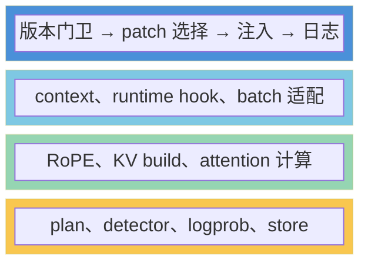
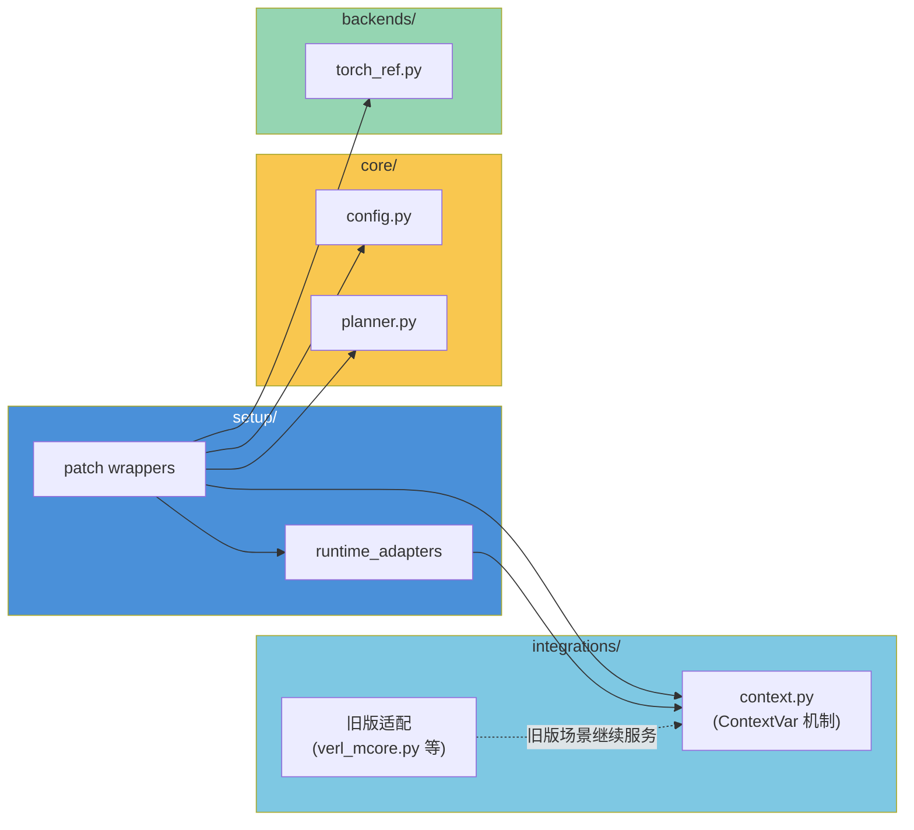
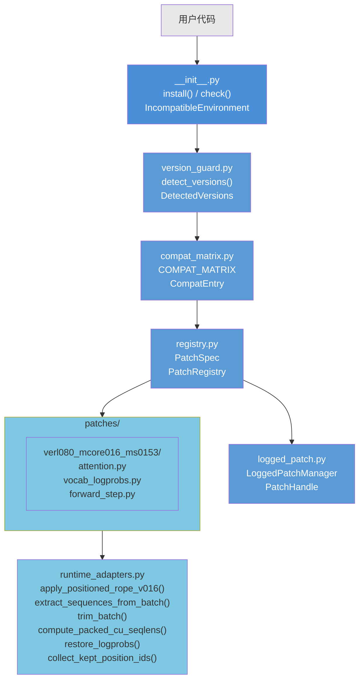
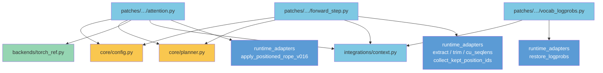
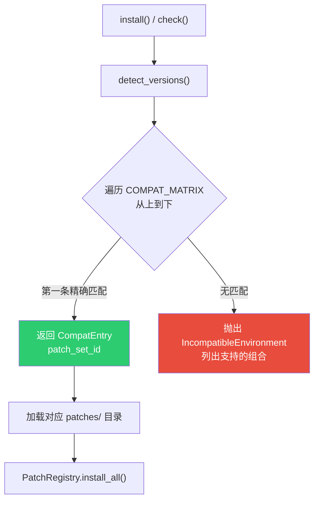
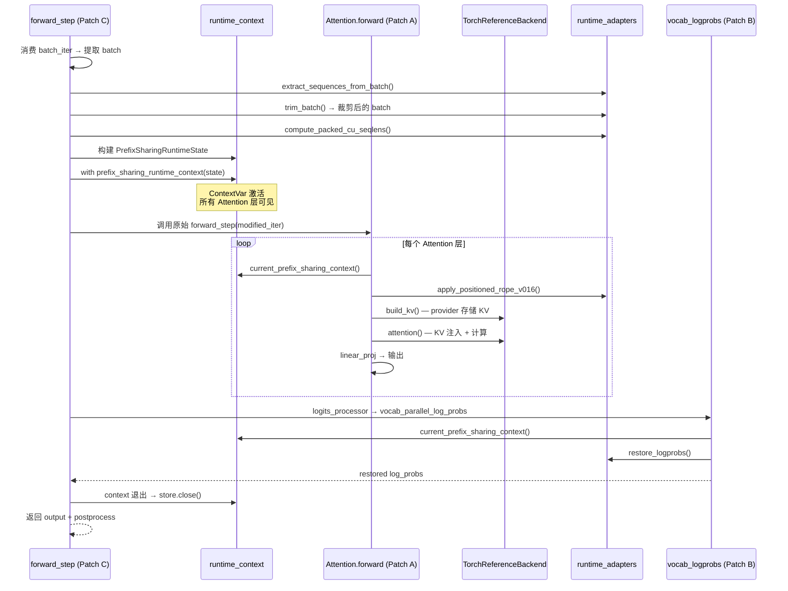
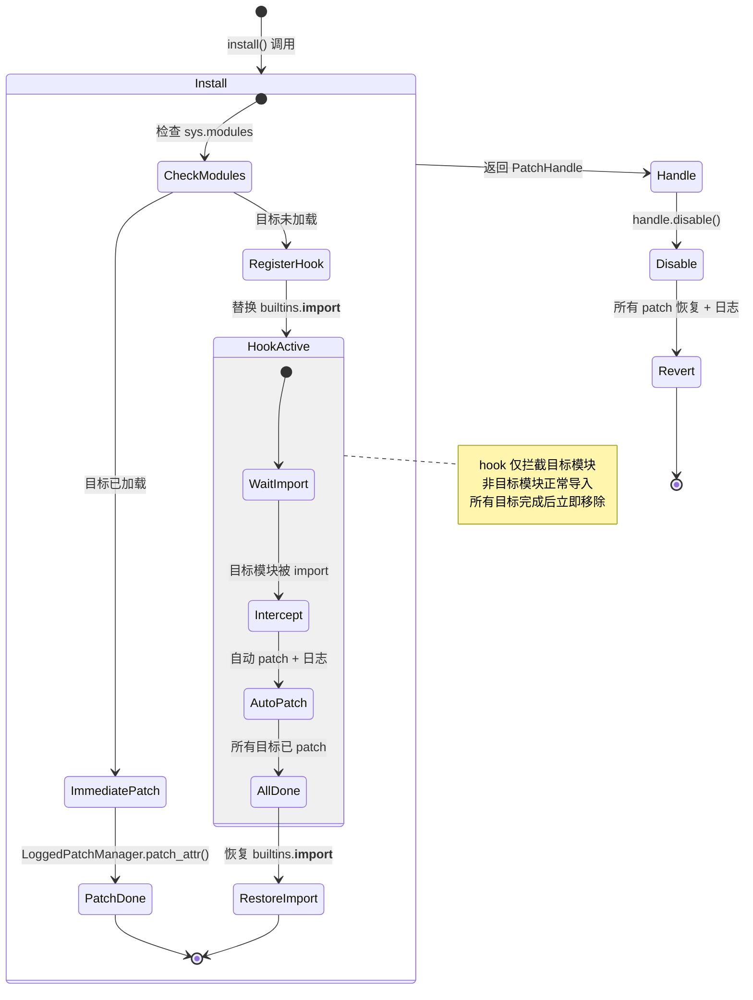
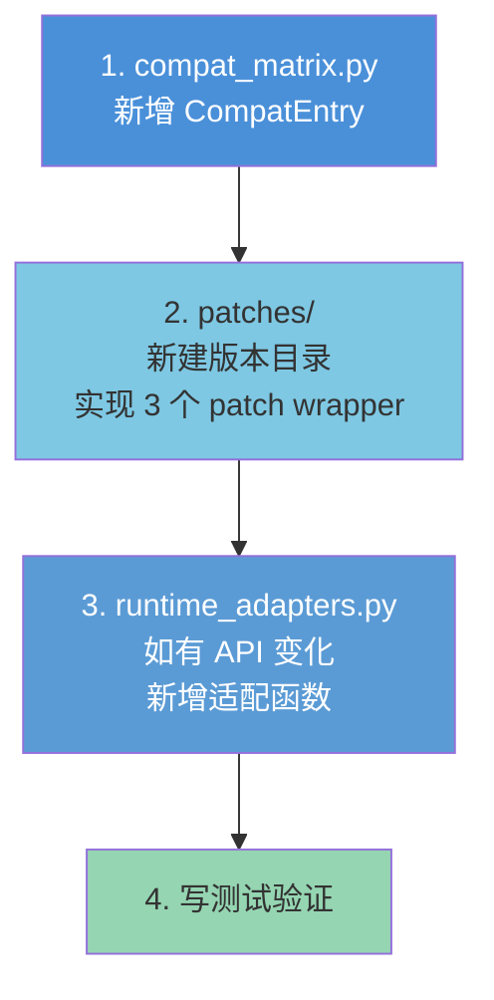
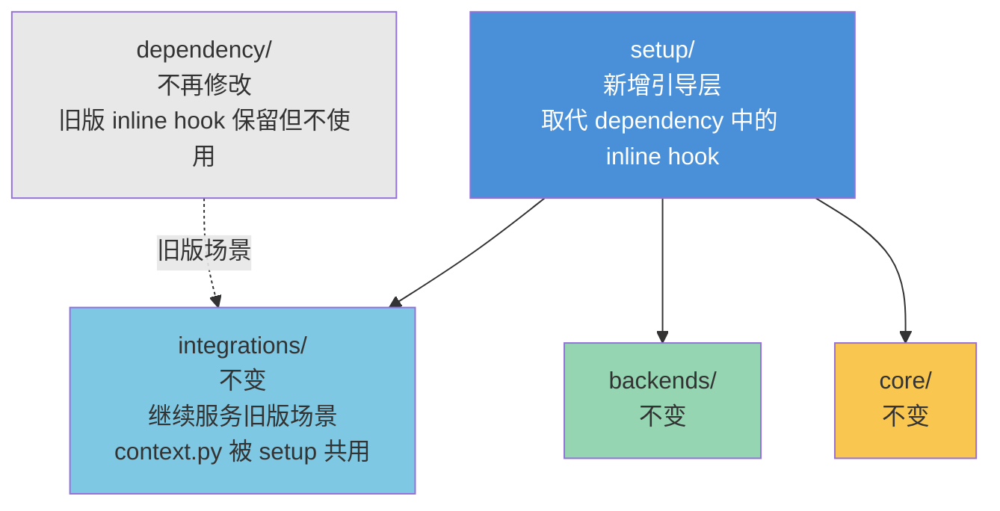

# `prefix_sharing/setup/` 模块设计文档

> 本文档描述 `setup` 模块的架构、职责边界、与其他模块的关系、文件清单、兼容矩阵、使用方式。

---

## 1. 模块概览

### 1.1 定位：引导层

`setup` 是 prefix-sharing 四层架构中最上层，负责**版本校验 → patch 选择 → 注入 → 管理**的引导流程：



### 1.2 职责边界

setup 模块**只做三件事**：

| 职责 | 说明 |
|------|------|
| **版本校验** | 探测运行环境中的 verl、Megatron Core、MindSpeed 版本，对照兼容矩阵决定能否 patch |
| **patch 注入** | 为校验通过的版本组合，选择对应的 patch wrapper，通过 `LoggedPatchManager` 运行时替换目标方法 |
| **patch 管理** | 提供 `describe()` 查看 patch 详情、`disable()` 回滚并打印恢复日志 |

setup **不做的事**：

- ❌ 不做 prefix detection、KV expansion、logprob restore、attention 计算——这些在 `core/`、`backends/`、`integrations/`
- ❌ 不沉淀任何 prefix-sharing 语义逻辑
- ❌ 不修改 `dependency/` 中任何源码文件
- ❌ 不依赖 `integrations/` 的旧版适配函数（`maybe_run_prefix_sharing_attention`、`build_prefix_sharing_micro_batch` 等）

### 1.3 与 integrations/ 的关系



关键区别：setup 的 patch wrapper **不再调用** `integrations/megatron_runtime.maybe_run_prefix_sharing_attention` 或 `integrations/verl_mcore.build_prefix_sharing_micro_batch`——这些函数内部依赖旧版 API。setup 自己封装新版适配逻辑，确保 `integrations/` 一行不改。

**唯一共用点**：`integrations/context.py`（ContextVar + `prefix_sharing_runtime_context`）——这是跨版本的 runtime 机制，setup 和 integrations 共用。

> ⚠️ **注意**：`PrefixSharingRuntimeState` 定义在 `integrations/verl_mcore.py` 中，而非 `integrations/context.py`。setup 的 `forward_step.py` 通过 `integrations/__init__.py` 的 re-export 导入该类。

---

## 2. 架构设计

### 2.1 模块内部结构



### 2.2 组件职责表

| 组件 | 核心类/函数 | 职责 |
|------|------------|------|
| `__init__.py` | `install()`, `check()`, `IncompatibleEnvironment` | 公共 API 入口，协调校验→匹配→注入 |
| `version_guard.py` | `detect_versions()` → `DetectedVersions` | 探测 4 个库的运行时版本 |
| `compat_matrix.py` | `COMPAT_MATRIX` → `CompatEntry` | 版本兼容规则表，精确字符串匹配 |
| `registry.py` | `PatchSpec`, `PatchRegistry` | Patch 注册 + import hook 调度 |
| `logged_patch.py` | `LoggedPatchManager`, `PatchHandle` | 属性替换 + 日志 + 回滚 |
| `runtime_adapters.py` | 6 个适配函数 | 新版 API 适配（RoPE、batch、logprob） |
| `patches/verl080_mcore016_ms0153/` | 3 个 `PatchSpec` | verl 0.8 + mcore 0.16 + MindSpeed 0.15.3 的具体 patch 实现 |

### 2.3 依赖关系



setup 不依赖 integrations 的 `verl_mcore.py`、`megatron_runtime.py`、`megatron_attention.py`——新版适配逻辑全在 `setup/runtime_adapters.py` 中。

---

## 3. 版本兼容性

### 3.1 兼容矩阵

只支持以下版本组合，**精确字符串 `==` 匹配**，不支持版本范围模糊匹配：

#### 组合一：verl + Megatron Core + MindSpeed

| 库 | 版本 | patch_set_id |
|----|------|-------------|
| verl | `0.8.0.dev` | `verl080_mcore016_ms0153` |
| megatron-core | `0.16.0` | |
| mindspeed | `0.15.3` | |

适用场景：verl PPO pipeline + MindSpeed NPU 加速

Patch 目标：
- `Attention.forward`（Megatron Core 0.16.0）
- `vocab_parallel_log_probs_from_logits`（verl 0.8.x）
- `MegatronEngineWithLMHead.forward_step`（verl 0.8.x）

#### 组合二：Megatron Core + MindSpeed（无 verl）

| 库 | 版本 | patch_set_id |
|----|------|-------------|
| megatron-core | `0.12.0` | `mcore012_ms012` |
| mindspeed | `0.12.0` | |
| verl | 不需要 | |

适用场景：纯 Megatron + MindSpeed 训练，不使用 verl PPO pipeline

> ⚠️ **注意**：组合二的 `mcore012_ms012/` patch 目录尚未创建，待 mindspeed 0.12 + megatron-core 0.12 快照就位后再实现。当前代码中 `COMPAT_MATRIX` 的组合二版本号为精确值 `"0.12.0"`，与 `"0.12.x"` 范围表述不同——实际只能匹配 `0.12.0`。

### 3.2 版本探测来源

| 库 | 运行时版本标识 | 探测方式 |
|----|-------------|---------|
| verl | `verl.__version__` | 属性访问 |
| megatron-core | `megatron.core.__version__` | 属性访问 |
| mindspeed | `importlib.metadata.version("mindspeed")` | 包管理器查询（MindSpeed 不暴露 `__version__`） |

### 3.3 匹配规则



`CompatEntry` 完整字段：

```python
@dataclass
class CompatEntry:
    verl: str | None            # 精确版本号，None 表示不需要该库
    megatron_core: str | None
    mindspeed: str | None
    patch_set_id: str
    notes: str = ""              # 附加说明
```

---

## 4. 核心机制

### 4.1 Patch 注入流程

三个核心 Patch 分别拦截不同层级的运行时方法：

| Patch | 目标方法 | 拦截逻辑 |
|-------|---------|----------|
| **A — Attention** | `Attention.forward` | 检查 context → prefix-sharing 路径（QKV + RoPE + KV expansion + attention + projection）/ 原始路径 |
| **B — Logprob** | `vocab_parallel_log_probs_from_logits` | 检查 context → 调用原始 + `restore_logprobs()` / 直接调用原始 |
| **C — Forward Step** | `MegatronEngineWithLMHead.forward_step` | 消费 batch → prefix-sharing reorg → 构建 context → 包装回原始方法 |


### 4.2 Patch 联动数据流



### 4.3 Import Hook 机制

当 `install()` 被调用时，若目标模块尚未加载（不在 `sys.modules` 中），registry 会临时替换 `builtins.__import__`，在该模块被 import 时自动应用 patch。



**安全性保证**：

- import hook 仅在目标模块未加载时激活
- 所有目标模块加载完毕后**立即移除** hook，恢复原始 `builtins.__import__`
- 不影响非目标模块的导入行为（仅做 dict lookup 检查模块名）

---

## 5. 使用指南

### 5.1 快速上手

```python
import prefix_sharing.setup as ps_setup

# 一键安装（校验 → 匹配 → 注入）
handle = ps_setup.install()

# 仅校验版本
versions = ps_setup.check()
print(f"verl={versions.verl}, mcore={versions.megatron_core}, ms={versions.mindspeed}")

# 查看 patch 详情（名称 + 状态）
print(handle.describe())

# 查看被替换函数的源码（验证 patch 内容）
print(handle.inspect_patch())       # 所有 patch 的源码
print(handle.inspect_patch(1))      # 仅第 1 个 patch 的源码

# 回滚所有 patch
handle.disable()
``

> ⚠️ **注意**：当前 `prefix_sharing/__init__.py` 尚未导出 `install`/`check`/`IncompatibleEnvironment`，需通过 `prefix_sharing.setup` 子模块访问。

### 5.2 YAML 配置

verl YAML 配置文件中启用 prefix-sharing（不改 verl 源码）：

```yaml
actor:
  strategy: megatron
  megatron:
    override_transformer_config:
      prefix_sharing_config:
        enable_prefix_sharing: true
        min_prefix_len: 16
        min_group_size: 2
```

### 5.3 日志输出示例

**安装时**：

```
[PS] Detected: verl=0.8.0.dev, megatron_core=0.16.0, mindspeed=0.15.3
[PS] Version check → compatible (patch_set=verl080_mcore016_ms0153)
[PS] Patched megatron.core.transformer.attention.Attention.forward: Attention.forward → patched_forward
[PS] Patched verl.utils.megatron.tensor_parallel.vocab_parallel_log_probs_from_logits → patched_fn
[PS] Patched verl.workers.engine.megatron.transformer_impl.MegatronEngineWithLMHead.forward_step → patched_forward_step
[PS] install() complete. 3 patches active. patch_set=verl080_mcore016_ms0153
```

**查看状态**：

```python
>>> handle.describe()
PatchHandle (ACTIVE, 3 patches):
  1. megatron.core.transformer.attention.Attention.forward → patched_forward
  2. verl.utils.megatron.tensor_parallel.vocab_parallel_log_probs_from_logits → patched_fn
  3. verl.workers.engine.megatron.transformer_impl.MegatronEngineWithLMHead.forward_step → patched_forward_step
```

**回滚时**：

```
[PS] Restored MegatronEngineWithLMHead.forward_step → original
[PS] Restored vocab_parallel_log_probs_from_logits → original
[PS] Restored Attention.forward → original
[PS] All 3 patches reverted.
```

**版本不兼容时**：

```
IncompatibleEnvironment: 不兼容的版本组合: verl=0.9.0, megatron_core=0.17.0, mindspeed=None
  支持的组合：
  组合一: verl=0.8.0.dev + megatron-core=0.16.0 + mindspeed=0.15.3
  组合二: megatron-core=0.12.0 + mindspeed=0.12.0 (无 verl)
```

### 5.4 验证 patch 内容

`install()` 后，用户可通过 `inspect_patch()` 查看被替换函数的源码，确认替换逻辑正确：

```python
>>> handle = ps_setup.install()

# 查看所有 patch 的状态和替换函数源码
>>> print(handle.inspect_patch())

# 仅查看第 1 个 patch（Attention.forward）的源码
>>> print(handle.inspect_patch(1))

── Attention.forward → prefix-sharing intercept (mcore 0.16.x) ── [pending: import megatron.core.transformer.attention to activate]

def make_attention_patch(original_forward):
    """创建 Attention.forward 的 patch wrapper。"""
    def patched_forward(self, hidden_states, attention_mask, ...):
        ctx = current_prefix_sharing_context()
        if ctx is not None:
            # prefix-sharing path: QKV + RoPE + KV expansion + attention + projection
            ...
        # normal path: call original_forward
        return original_forward(self, hidden_states, ...)
    return patched_forward
```

**状态说明**：

| 状态 | 含义 |
|------|------|
| `[applied]` | 目标模块已加载，patch 已替换生效，显示替换函数源码 |
| `[pending: import X to activate]` | 目标模块尚未加载，import hook 已注册；显示 patch_factory 源码；模块 import 后自动生效 |

当目标模块被 import 后，`inspect_patch()` 会自动从 `[pending]` 变为 `[applied]`，并展示实际替换函数的源码。

---

## 6. 约束与扩展

### 6.1 Phase 1 约束

所有版本组合的 patch 均遵循 Phase 1 约束：

| 约束 | 原因 |
|------|------|
| PP = 1 | prefix KV injection 跨 PP stage 语义不清 |
| CP = 1 | THD packed + prefix KV 的 cu_seqlens 在 CP 下需特殊处理 |
| 无 fused kernels | fused_forward_fn 路径完全绕过 logits_processor，无法做 logprob restore |
| 无 fused QKV+RoPE | 自定义 position-aware RoPE 与 fused QKV+RoPE 不兼容 |
| 无 multi-modal | Phase 1 仅支持纯文本因果 LM |
| 无 output gate | Phase 1 禁止；后续可扩展 |
| 无 MTP training | MTP loss_mask 与 prefix trim 交互复杂 |

### 6.2 扩展新版本组合

当 verl/Megatron 发布新版本时：



**不变的文件**：`dependency/` 全部、`core/` 全部、`backends/` 全部、`integrations/` 全部。

---

## 7. 文件清单

### 7.1 实际文件结构

```
prefix-sharing/prefix_sharing/setup/
├── __init__.py                          # install(), check(), IncompatibleEnvironment
├── version_guard.py                     # detect_versions() → DetectedVersions
├── compat_matrix.py                     # COMPAT_MATRIX, CompatEntry
├── registry.py                          # PatchSpec, PatchRegistry + import hook
├── logged_patch.py                      # LoggedPatchManager, PatchHandle, PatchRecord
├── runtime_adapters.py                  # 新版 API 适配（6 个函数）
└── patches/
    ├── __init__.py                      # re-export PatchSpec
    └── verl080_mcore016_ms0153/
        ├── __init__.py                  # PATCH_SET 导出
        ├── attention.py                 # Attention.forward patch (mcore 0.16 + MindSpeed)
        ├── vocab_logprobs.py            # vocab_parallel patch (verl 0.8)
        └── forward_step.py              # forward_step patch (verl 0.8 + MindSpeed)
```

### 7.2 文件职责明细

| 文件 | 状态 | 核心类/函数 | 职责 |
|------|------|------------|------|
| `setup/__init__.py` | 新增 | `install()`, `check()`, `IncompatibleEnvironment` | 公共 API 入口 |
| `setup/version_guard.py` | 新增 | `detect_versions()`, `DetectedVersions` | 版本探测 |
| `setup/compat_matrix.py` | 新增 | `COMPAT_MATRIX`, `CompatEntry` | 兼容规则表 |
| `setup/registry.py` | 新增 | `PatchSpec`, `PatchRegistry` | Patch 注册 + import hook |
| `setup/logged_patch.py` | 新增 | `LoggedPatchManager`, `PatchHandle`, `PatchRecord` | 属性替换 + 日志 + 回滚 |
| `setup/runtime_adapters.py` | 新增 | 6 个适配函数（见 §2.2） | 新版 API 适配 |
| `setup/patches/__init__.py` | 新增 | re-export `PatchSpec` | patches 子包入口 |
| `setup/patches/verl080_mcore016_ms0153/__init__.py` | 新增 | `PATCH_SET` | patch_set 导出 |
| `setup/patches/verl080_mcore016_ms0153/attention.py` | 新增 | `make_attention_patch()` | Attention.forward patch |
| `setup/patches/verl080_mcore016_ms0153/vocab_logprobs.py` | 新增 | `make_vocab_logprobs_patch()` | vocab_parallel patch |
| `setup/patches/verl080_mcore016_ms0153/forward_step.py` | 新增 | `make_forward_step_patch()` | forward_step patch |

**不变的文件**：`core/` 全部、`backends/` 全部、`integrations/` 全部、`dependency/` 全部。

### 7.3 与现有架构的衔接

加入 setup 层后，整体架构关系：



---

## 附录 A：runtime_adapters 函数清单

| 函数 | 用途 | 调用方 |
|------|------|--------|
| `apply_positioned_rope_v016()` | mcore 0.16.x cu_seqlens 参数的 RoPE 应用 | attention patch |
| `extract_sequences_from_batch()` | 从 batch 中提取 token 序列（NestedTensor + plain tensor） | forward_step patch |
| `trim_batch()` | 裁剪 batch 中 reuser 的 prefix tokens | forward_step patch |
| `compute_packed_cu_seqlens()` | THD packed 格式的 cu_seqlens 计算 | forward_step patch |
| `collect_kept_position_ids()` | 收集裁剪后保留的 position ids | forward_step patch |
| `restore_logprobs()` | THD 1D packed 格式的 logprob restore | vocab_logprobs patch |