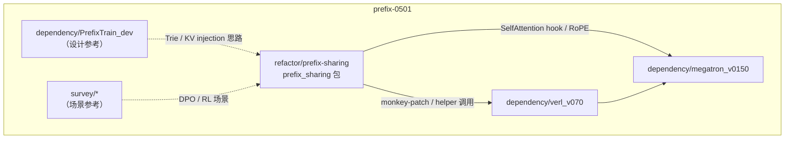
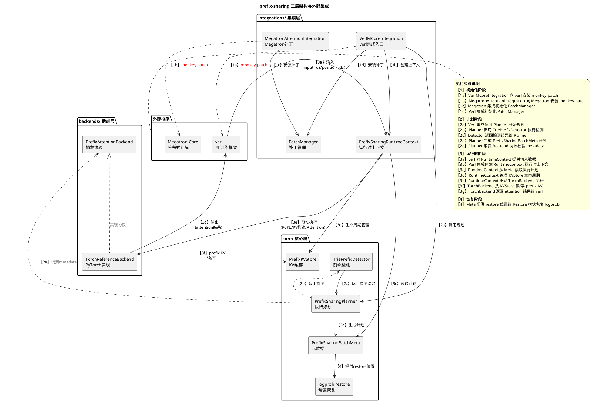
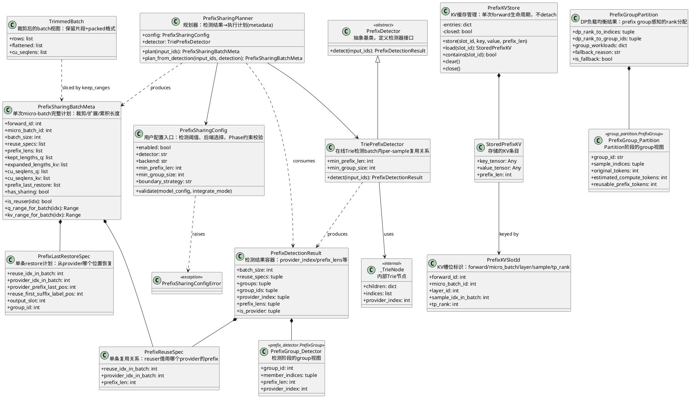
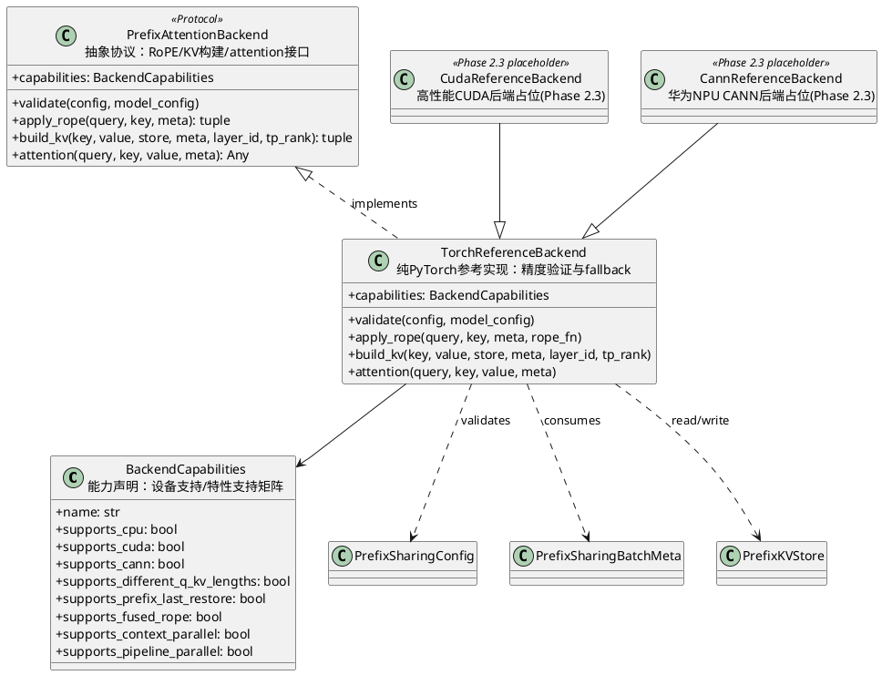
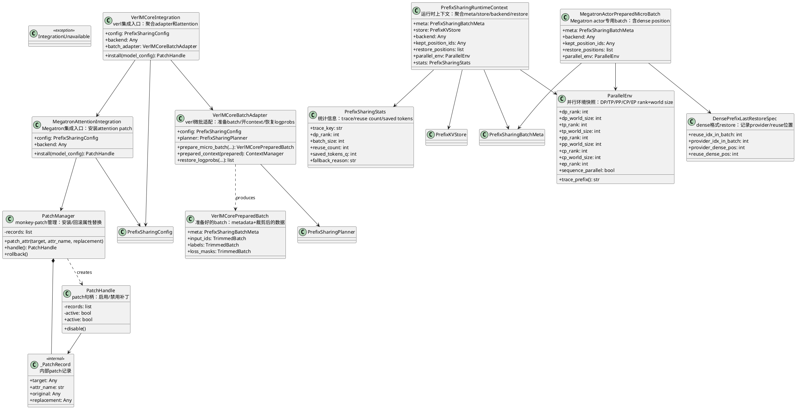
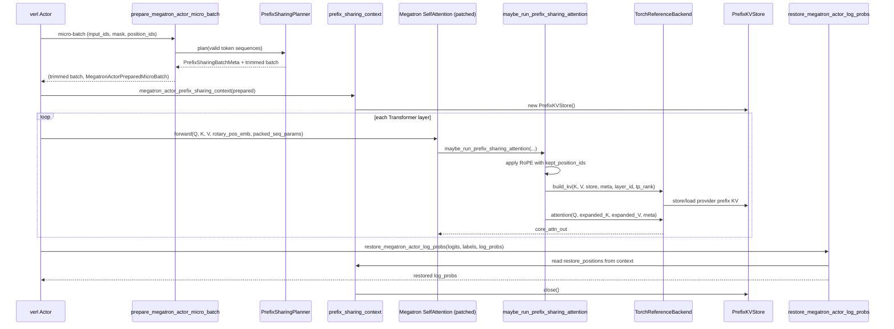

# prefix-0501 架构与类图

---

## 1. 文件组织

`prefix-0501` 以整个 monorepo 为版本管理单元，包含调研、依赖的快照版本、正式模块开发三部分：

```text
prefix-0501/
├── survey/                      # 调研与 PoC
│   ├── flash-preference/        # DPO / preference 训练中的 prefix 复用参考
│   └── dpo-prefix-sharing/      # prompt/response 边界明确的 prefix sharing 参考
├── dependency/                  # 集成目标与参考实现快照
│   ├── verl_v070/               # RL 训练框架（actor logprob / update 主路径）
│   ├── megatron_v0150/          # Megatron-Core attention / packed THD / RoPE
│   └── PrefixTrain_dev/         # 在线 Trie prefix 复用 PoC（设计参考）
└── refactor/prefix-sharing/     # 正式开发仓库（本包）
    ├── prefix_sharing/          # 核心 Python 包
    │   ├── core/                # 框架无关核心语义
    │   ├── backends/            # Attention 后端适配（torch/cuda/cann）
    │   └── integrations/          # verl/Megatron 集成与 patch 管理
    ├── tests/                   # unit / integrated / system 测试
    └── docs/                    # 设计文档与 roadmap
```

### 1.1 各目录职责

| 目录 | 角色 | 与 prefix-sharing 的关系 |
|------|------|--------------------------|
| `refactor/prefix-sharing` | 正式实现 | 框架无关 core + backend 适配 + verl/Megatron 集成 |
| `dependency/verl_v070` | 集成宿主 | actor micro-batch、DataProto、vocab-parallel logprob |
| `dependency/megatron_v0150` | 集成宿主 | SelfAttention、packed THD、RoPE、TP/PP/CP 并行状态 |
| `dependency/PrefixTrain_dev` | 设计参考 | 在线 Trie、KV injection 思路；**不可复现** `clone().detach()` bug |
| `survey/*` | 场景参考 | 收益形态、测试场景；不直接继承实现 |

### 1.2 依赖关系



---

## 2. prefix-sharing 宏观架构

### 2.1 分层设计

```text
core/          核心特性层，实现框架无关的ps核心语义：检测 → 规划 → 元数据 → KV 存储 → logprob 恢复
integrations/  集成层，将ps特性集成到verl+megatron中。尽量做薄，控制对verl和megatron的侵入式修改，方便未来模块化插入
backends/      后端层，为上层屏蔽硬件差异。消费上层传入的统一 metadata，负责 RoPE / attention的处理等
```

### 2.2 宏观架构

三层架构与外部框架集成关系：



### 2.3 核心流程

```mermaid
flowchart LR
    subgraph Input["输入"]
        IDS[input_ids]
    end

    subgraph Core["core/ 核心层"]
        DET["TriePrefixDetector<br/>检测共享前缀"]
        PLN["PrefixSharingPlanner<br/>生成执行计划"
        META["PrefixSharingBatchMeta<br/>元数据"]
        TRIM["batch_trim<br/>裁剪 batch"]
    end

    subgraph Backend["backends/ 后端层"]
        ROPE["apply_rope<br/>位置编码"]
        KV["build_kv<br/>KV Injection"]
        ATTN["attention<br/>注意力计算"]
    end

    subgraph Integration["integrations/ 集成层"]
        CTX["PrefixSharingRuntimeContext<br/>运行时上下文"]
        STORE["PrefixKVStore<br/>KV 缓存"]
        RESTORE["logprob restore<br/>Prefix-Last Restore"]
    end

    IDS --> DET
    DET --> PLN
    PLN --> META
    META --> TRIM
    META --> CTX
    CTX --> STORE
    TRIM --> ROPE
    ROPE --> KV
    KV --> STORE
    KV --> ATTN
    ATTN --> RESTORE
```

**流程说明**：

1. **检测阶段**：`TriePrefixDetector` 在 micro-batch 内识别共享前缀，建立 provider-reuser 关系
2. **规划阶段**：`PrefixSharingPlanner` 生成 metadata，决定每行的 Q 裁剪范围、KV 扩展方式、restore 位置
3. **裁剪阶段**：`batch_trim` 按 metadata 裁剪 input/label/mask，生成 packed THD 格式
4. **运行时阶段**：`PrefixSharingRuntimeContext` 维护 KVStore，每层 attention 通过 backend 执行 RoPE、KV Injection、attention
5. **恢复阶段**：`logprob restore` 从 provider 恢复 reuser 首 token 的 logprob，保证训练语义一致

### 2.3 精度方案

**One-Forward + KV Injection + Prefix-Last Restore**

为确保 prefix sharing 与普通 causal LM 训练的精度完全一致，采用三阶段协作方案：

| 组件 | 作用 | 关键设计 |
|------|------|----------|
| **One-Forward** | provider 完整计算，reuser 仅计算 suffix | provider 存储 prefix KV，reuser 复用之 |
| **KV Injection** | 让 reuser 的 suffix query 能 attend 到 provider 的 prefix KV | 在 attention 层将 provider prefix K/V 拼接到 reuser suffix K/V 之前 |
| **Prefix-Last Restore** | 恢复 reuser 首个 suffix token 的 logprob | 从 provider 的 prefix-last 位置读取 logits，计算首 token logprob 并插入 |

**关键约束**：缓存的 prefix KV **绝不 detach()**，保留在 autograd 计算图中确保梯度正确回流到 shared prefix。

---

## 3. Core 层类图

> **职责**：实现框架无关的 prefix sharing 核心语义——检测共享前缀、规划执行布局、管理 KV 生命周期、恢复 logprob 精度。

Core 层不依赖 PyTorch / verl / Megatron（`logprob.py` 与 `group_partition.py` 对 torch 为 lazy import 或可选）。



---

## 4. Backends 层类图

> **职责**：消费统一 metadata，执行硬件相关的 attention 计算——RoPE 应用、KV Injection、核心 attention 算子，屏蔽 CPU/CUDA/CANN 硬件差异。

Backend 通过 `Protocol` 定义接口，reference 实现基于纯 PyTorch；CUDA/CANN 当前继承 `TorchReferenceBackend`（Phase 2.3 将接入 flash-attn / TE / CANN 融合算子）。



### 4.1 Backend 运行时 KV 扩展逻辑

```text
对 batch 中每个 sample i（layer L, tp_rank R）:

  provider (非 reuser):
    store[forward_id, micro_batch_id, L, i, R] = full K/V
    expanded_KV = full K/V

  reuser (provider_index[i] != i, prefix_lens[i] > 0):
    load provider slot → slice prefix K/V
    expanded_KV = concat(provider_prefix_KV, suffix_KV)
    store[forward_id, micro_batch_id, L, i, R] = expanded_KV  (transitive reuse)
```

---

## 5. Integrations 层类图

> **职责**：薄适配层——管理 monkey-patch 生命周期、传递运行时上下文、衔接 verl/Megatron 数据流，将 prefix sharing 能力注入训练框架。

Integrations 负责 patch 生命周期、runtime context 传递，以及 verl actor 微批预处理/后处理。



### 5.1 集成入口函数（模块级 API）

| 函数 | 模块 | 用途 |
|------|------|------|
| `enable_prefix_sharing()` | `verl_mcore` | 安装 Megatron attention patch |
| `prepare_megatron_actor_micro_batch()` | `verl_mcore` | verl actor 微批 in-place 裁剪 + 生成 prepared batch |
| `megatron_actor_prefix_sharing_context()` | `verl_mcore` | 打开 runtime context（供 patched attention 读取） |
| `restore_megatron_actor_log_probs()` | `verl_mcore` | forward 后恢复 reuser 首 suffix logprob |
| `maybe_run_prefix_sharing_attention()` | `megatron_runtime` | patched SelfAttention.forward 内的 attention 分支 |
| `reorder_dataproto_for_prefix_group_dp_balance()` | `verl_dp_balance` | Phase 2 DP 按 prefix group 重排 DataProto |
| `current_parallel_env()` | `parallel_env` | 读取 Megatron parallel_state 构建 ParallelEnv |

---

## 6. 端到端运行时序列

verl + Megatron actor 一次 forward 的主路径：



---

## 7. 测试分层

```text
tests/
├── unit_test/           # core 语义、config、planner、store、parallel_env
├── integrated_test/     # patch 生命周期、verl helper、DP balance
│   └── optional/        # 需 torch / verl / GPU 的 optional 测试
└── system_test/         # Phase 1 core 端到端系统测试
```

---

## 8. Phase 2 演进中的架构扩展点

当前类图已预留以下 Phase 2 扩展（详见 `parallel-plan.md`、`design-history.md`）：

| 扩展点 | 涉及类/模块 | Phase 2 目标 |
|--------|-------------|--------------|
| TP local K/V shard | `PrefixKVSlotId.tp_rank`、`ParallelEnv.tp_*` | 各 TP rank 独立 slot |
| DP 生命周期隔离 | `PrefixSharingBatchMeta.forward_id/micro_batch_id` | micro-batch / grad accumulation 不串 cache |
| PP stage-local store | `PrefixKVStore` + `ParallelEnv.pp_*` | 各 PP stage 独立 store |
| CP KV exchange | `ParallelEnv.cp_*` + backend | 跨 rank restore / exchange |
| BackendCapabilities 扩展 | `BackendCapabilities` | 声明 parallel / fused path 能力矩阵 |
| DP 负载均衡 | `group_partition` + `verl_dp_balance` | uid 驱动的 prefix group partition |

---

## 9. 命名冲突说明

包内存在两个同名但语义不同的 `PrefixGroup`：

| 类 | 模块 | 语义 |
|----|------|------|
| `PrefixGroup` | `core/prefix_detector.py` | 检测阶段兼容/debug 视图，按 `(provider_index, prefix_len)` 分组 |
| `PrefixGroup` | `core/group_partition.py` | DP 调度阶段 workload 估算单元，按 verl `uid` 等 group id 分组 |

文档与类图中通过后缀 `_Detector` / `_Partition` 区分；源码中尚未重命名，调用方需注意 import 来源。
